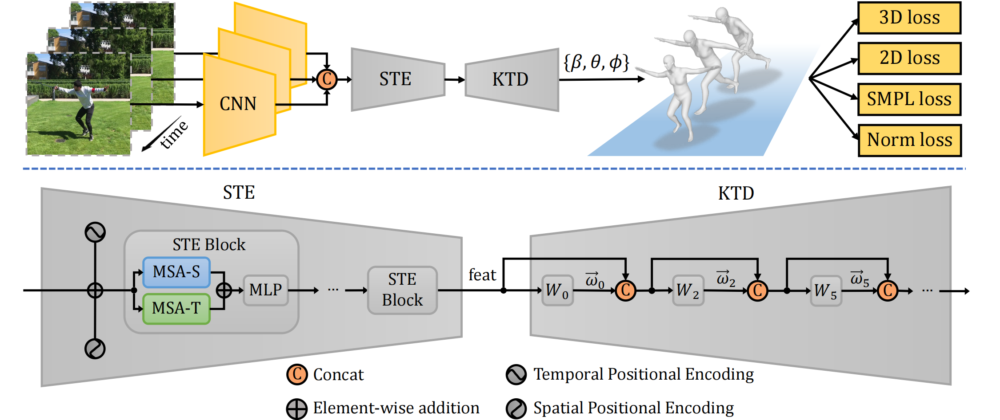
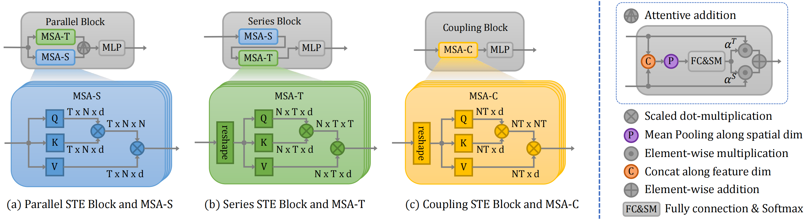

<p float="center">
  
  
</p>

<p float="center">
  
  
</p>

## [MAED: Encoder-decoder with Multi-level Attention for 3D Human Shape and Pose Estimation](https://arxiv.org/abs/2109.02303)

## Getting Started

Our codes are implemented and tested with python 3.6 and pytorch 1.5.

Install Pytorch following the official guide on Pytorch website.

And install the requirements using `virtualenv` or `conda`:
```bash
pip install -r requirements.txt
```

## Data Preparation
Refer to [data.md](doc/data.md) for instructions.

## Training

### Stage 1 training
Generally, you can use the distributed launch script of pytorch to start training.

For example, for a training on 2 nodes, 4 gpus each (2x4=8 gpus total):
On node 0, run:
```shell script
python -u -m torch.distributed.launch \
    --nnodes=2 \
    --node_rank=0 \
    --nproc_per_node=4 \
    --master_port=<MASTER_PORT> \
    --master_addr=<MASTER_NODE_ID> \
    --use_env \
    train.py --cfg configs/config_stage1.yaml
```
On node 1, run:
```shell script
python -u -m torch.distributed.launch \
    --nnodes=2 \
    --node_rank=1 \
    --nproc_per_node=4 \
    --master_port=<MASTER_PORT> \
    --master_addr=<MASTER_NODE_ID> \
    --use_env \
    train.py --cfg configs/config_stage1.yaml
```
Otherwise, if you are using task scheduling system such as Slurm to submit your training tasks, you can refer to [this script](scripts/run.sh) to start your training:
```shell script
# training on 2 nodes, 4 gpus each (2x4=8 gpus total)
sh scripts/run.sh 2 4 configs/config_stage1.yaml
```
The checkpoint of training will be saved in [`results/`] by default. You are free to modify it in the config file.

### Stage 2 training
Use the last checkpoint of stage 1 to initialize the model and starts training stage 2. 
```shell script
# On Node 0.
python -u -m torch.distributed.launch \
    --nnodes=2 \
    --node_rank=0 \
    --nproc_per_node=4 \
    --master_port=<MASTER_PORT> \
    --master_addr=<MASTER_NODE_ID> \
    --use_env \
    train.py --cfg configs/config_stage2.yaml --pretrained <PATH_TO_CHECKPOINT_FILE>
```
Similar on node 1.

## Evaluation

To evaluate model on 3dpw test set:
```shell script
python eval.py --cfg <PATH_TO_EXPERIMENT>/config.yaml --checkpoint <PATH_TO_EXPERIMENT>/model_best.pth.tar --eval_set 3dpw
```

Evaluation metric is Procrustes Aligned Mean Per Joint Position Error (PA-MPJPE) in mm.

| Models          | PA-MPJPE &#8595; | MPJPE &#8595; | PVE &#8595; | ACCEL &#8595; |
|-----------------|:--------:|:--------:|:--------:|:--------:|
| HMR  (w/o 3DPW) |   81.3   |   130.0  |   \-     |   37.4   |
| SPIN (w/o 3DPW) |   59.2   |   96.9   |   116.4  |   29.8   |
| MEVA (w/ 3DPW)  |   54.7   |   86.9   |   \-     | **11.6** |
| VIBE (w/o 3DPW) |   56.5   |   93.5   |   113.4  |   27.1   |
| VIBE (w/ 3DPW)  |   51.9   |   82.9   |   99.1   |   23.4   |
| ours (w/o 3DPW) | **50.7** | **88.8** | **104.5**|   18.0   |
| ours (w/ 3DPW)  | **45.7** | **79.1** | **92.6** |   17.6   |
